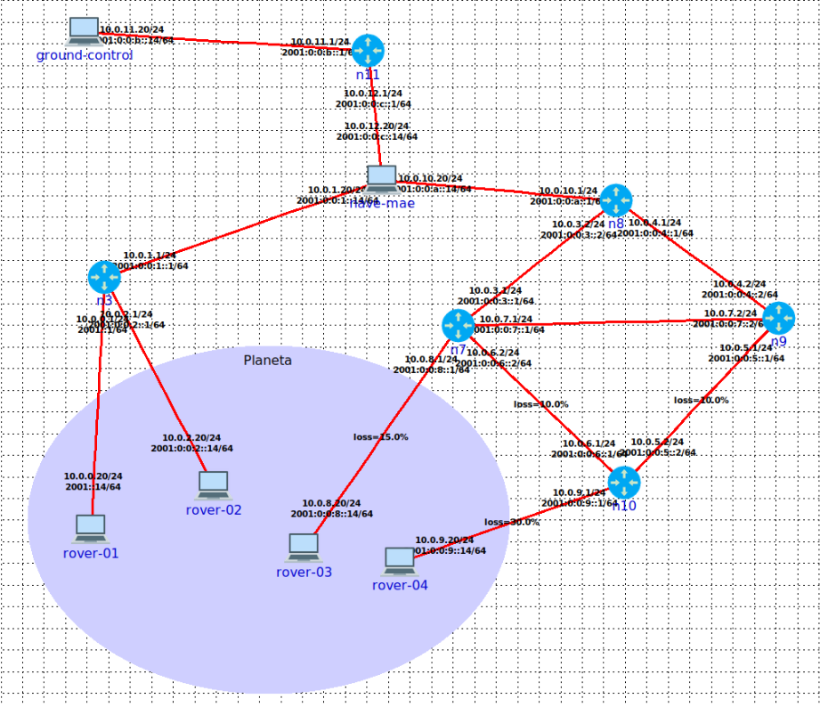

# Communication Protocols for Planetary Exploration

This main objective of this project was to design and implement two main communicaiton protocols for a network operating over a planetary exploration scenario involving a mothership, multiple rovers, and the supervisory interface Ground Control. The protocols implemented are the following: 
- TelemetryStream (TS), built over TCP, responsible for continuously monitoring the rovers' status
- MissionLink (ML), built over UDP, dedicated to defining, transmitting, and tracking missions. 

This solution was designed to operate within the following topology, which is defined [here](config/Topologia.xml).

<p align="center">
  
</p>

<br>

Both the protocols are specified in the [`report`](report.pdf) (PT) along with other relevant information.

Project developed for the Computer Communications course during the 3rd year of Uminho's Software Engineering bachelors.

## Team:
* Sofia Freitas ([`sofimfreitas`](https://github.com/sofimfreitas))
* Soraia Pereira ([`sooraia`](https://github.com/sooraia))


# Setup
The network topology is defined in [`config/Topologia.xml`](config/Topologia.xml).
The following instructions explain how to set up the system using [this dockerized version of Coreemu](https://github.com/eivarin/Dockerized-Coreemu-Template) after copying the project to `/volume` and starting a session with the topology in the Core emulator. Change the `PROJECT_DIR` variable in [`setup.sh`](setup.sh) if necessary.


```
docker exec -it core bash
```

Go to the project directory and run the setup script:
```
./setup.sh start
```
To stop, run:
```
./setup.sh stop
```
## Ground Control Interface

To access the Ground Control web interface using firefox:
```
firefox ground/index.html
```

## Setting up each component manually
Alternatively, each component can be executed manually.

In a shell in the mothership:
```
bash config/mother_route_setup.sh  # Setting up the routing table for the mothership
python -m mother # optionally use the -l flag to create files with the ML logs in /tmp
```

In a shell in each rover:
```
python -m rover # optionally use the -l flag to create files with the ML logs in /tmp
```
